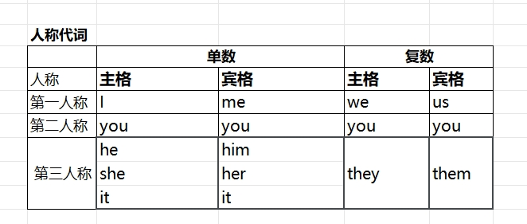
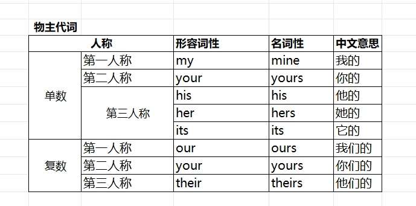
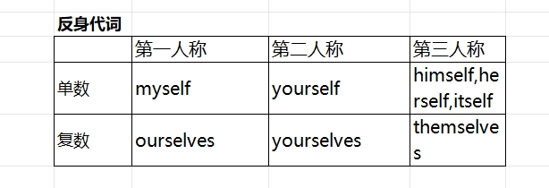
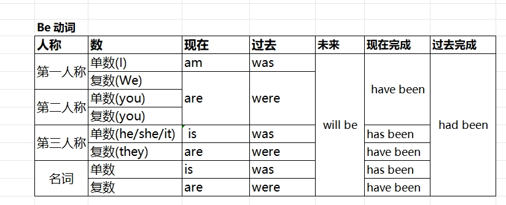

#### 词性

名词(n)。指代人、事物、地点或抽象概念的词。
动词(v)。表示动作或状态的词。
形容词(adj)。用来修饰名词的词，表示特性或特征。
副词(adv)。修饰动词、形容词或其他副词的词，常表示程度或方式。
代词(pron)。用来代替名词的词。
冠词(art)。用于名词前，帮助指明名词的范围或性质。
数词(num)。表示数量或顺序的词。
介词(prep)。表示人与事物、事物与事物之间的关系或位置。
连词(conj)。用来连接两个句子或从句的词。
感叹词(int)。表示情感或情绪的词.


### 一、代词(pron)

**代词**, 是用来代替名词的词语，用于避免重复使用名词或指代特定的人或事物。

- 人称代词, 用来代替特定的人称，包括第一人称、第二人称和第三人称。
- 物主代词, 用来表示所属关系，代替名词所表达的所有权。
- 反身代词, 用于表示动作反射到主语自身上。
- 相互代词, 用于表示相互关系或动作
- 指示代词, 用来指示或指代特定的人或事物
- 关系代词, 用来引导定语从句，并在从句中担任主语或宾语。
- 疑问代词, 用于提问特定的人或事物
- 不定代词, 用来指代不确定的人或事物


#### 1、人称代词


人称代词做句子的不同成份, 需要使用不同的"格"。
> “格”可以理解为一种在句子中表示不同语法功能和关系的形式。

#### 2、物主代词
mine, yours, his, hers, its, ours, theirs

**名词性物主代词**: 用于替代名词, 直接在句子中充当名词的角色
**形容词性物主代词**: 用于修饰名词, 放在名词前面构成名词短语


#### 3、反身代词


#### 4、相互代词
each other, one another

#### 5、指示代词
this, that, these, those

#### 6、关系代词
who, whom, whose, which, that

#### 7、疑问代词
who, whom, whose, which, what

#### 8、不定代词
all, another, any, anybody, anyone, anything, each, everybody, everyone, everything, nobody, none, nothing, one, somebody, someone, something, several, some, few, many, much, etc.


### 二、动词(v)

- 实义动词(Main Verbs), 表示动作、状态或存在的动词，如"run"（跑）、"eat"（吃）等。
- 系动词(Linking Verbs), 用于连接主语和主语补足语，表示状态或特征的动词，如"be"（是）、"seem"（似乎）等。
- 助动词(Modal Verbs), 用来修饰实义动词，表达情态、推测、能力、愿望等含义的动词，如"can"（能够）、"should"（应该）等。


**助动词用法**
- 构成疑问句, Do you like coffee?
- 构成否定句, I don't know.
- 表示强调, You do love to throw Mr. Dinosaur in the air.
- 倒装句, Never did I see such a thing. （表示否定意义的词位于句首时引起部分倒装）
- 复合谓语, 构成各种时态

#### 1、Be 动词

##### 1) 系动词
用于表示状态或特征, 含义是 "=", 有赋值的含义。




##### 2) 助动词
作为助动词，be 没有具体含义，而是与主要动词一起构成句子的谓语动词。这种情况下，be主要用来构成进行时和被动语态。


##### 3) 特殊句型
```js
// There be
There is a white ruler on the desk.

// 祈使句
Don't be so hard on me!

// 虚拟语气
Be he rich or poor, she will marry him.
```


#### 三、介词
介词服务于动词。
[text](https://www.ruanyifeng.com/blog/2007/08/what_is_preposition.html)


```js
of, at, in, on, during, for
over, above, below, before, after
by, with, through
except, save, bar, but
```


### 四、连词
what that who where
and then

### 五、副词
