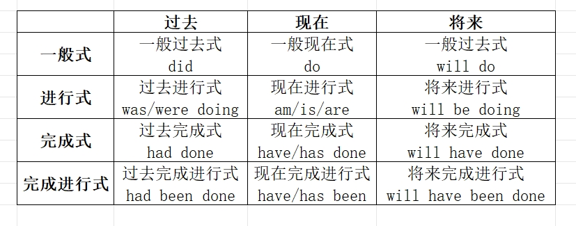

时态就是表示一个动作发生的时间（tense）和所处的状态（aspect）。
> https://www.duyidong.com/2018/03/28/English-16-tense/

https://www.peterjxl.com/English-Grammer/tense-past-future-tense/#%E5%B0%8F%E7%BB%93

https://www.cnblogs.com/55zjc/category/2206711.html?page=2



### 一、一般式
强调动作本身，即只强调动作发生的时间，不强调动作的状态；也就是说说这句话的人只关心这件事发生在过去现在还是将来，而不关心这件事有没有完成。

#### 1、一般过去时
```js
I bought some fruits yesterday.
```

#### 2、一般现在时
```js
I buy some fruits
```

#### 3、一般将来时
```js
// 1) will + do
He will live in a modern city.

// 2) be going to + do
I‘m going to have lunch.
```

### 二、进行式

#### 1、过去进行式
表示过去正在做某事。

```js
// sb. was doing sth.
I was pairing with Eli when Luke called me.
```

#### 2、现在进行式
```js
// sb. be doing sth.

// 1) 表示现在正在发生的动作
It’s raining heavily now.

// 2)表示即将发生的动作
We are going to lunch soon.
```


#### 3、将来进行式
表示将来某时正在做的事情，强调对动作本身的描写，也是一般态的生动模式。

```js
// sb. will be doing sth.
They will be arriving here tomorrow.
```


### 三、完成式
强调动作结果，在表意中时间被弱化，因此很容易忽略时态中的“时”

#### 1、过去完成式
表示截止到过去某时位置所完成的动作或经验的总结。

过去完成时不能单独存在，要与另一使用一般过去时的句子或者表示过去的副词短语连用。had 译为“已经”或”曾经“

```js
// sb. had did sth.

I had opened this feature toggle before last release.
```


#### 2、现在完成式
```js
// sb. have/has did sth.

// 1) 表示到现在为止已经完成的动作（发生时间不明确）
DICE Team has completed the AMI upgrade.

// 2) 如果是延续性动词，表示持续到现在的动作或状态：（be 动词是可延续的）
Cloud hosting team has been doing SSL upgrade for two weeks.
```

现在完成时常用时间副词:
- 自从... since + 时间点
- 有若干时间之久… for + 时间段
- 到目前为止... so far/up to now
- 最近... recently/lately
- 一次/两次/几次/多次... once/twice/a few times/many times
- 过去若干年/月/日以来... over/during/for + the last/past + 数字 + years/months/days

#### 3、未来完成式
表示到将来某时为止所做完成或仍然继续的动作或经验等。常与介词 by 构成时间状语连用，表示“到…的时候”，表示对将来这个时间点之前的一个或一系列动作的总结：

```js
// sb. will have did sth.

By the end of this iteration, we will have finished work on the new brand.
```

### 四、完成进行式

#### 1、过去完成进行式
```js
// had been + Ving

I had been eating lunch when he arrived.
```

#### 2、现在完成进行式
表示从过去某一时间开始一直持续到现在，并且可能还在继续进行的动作。
```js
//  have/has been + Ving

I have been playing tennis for two hours.
```

#### 3、将来完成进行式
```js
// will have been + Ving

I will have been training for a month tomorrow.
```


#### 过去将来时
肯定句：主语+be(was，were) going to+动词原形+其他
否定句：主语+be(was，were)not going to+动词原形+其他
疑问句：Be(Was，Were)+主语+going to+动词原形+其他
肯定句：主语+would(should)+动词原形+其他
否定句：主语+would(should)not+动词原形+其他
疑问句：Would(Should)+主语+动词原形+其他
